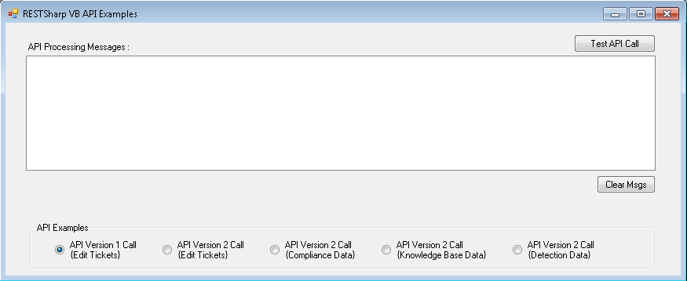

# vb_net_rest_sharp

This VB.NET applet demonstrates how to connect to the QualysGuard API.

Note: This script requires a username and password to be hardcoded.

# Dependencies

This script relies on the following:

* .NET 4 framework
* [RestSharp library](http://restsharp.org/).

# Legal

Thanks to contributor Brett Dickerson.